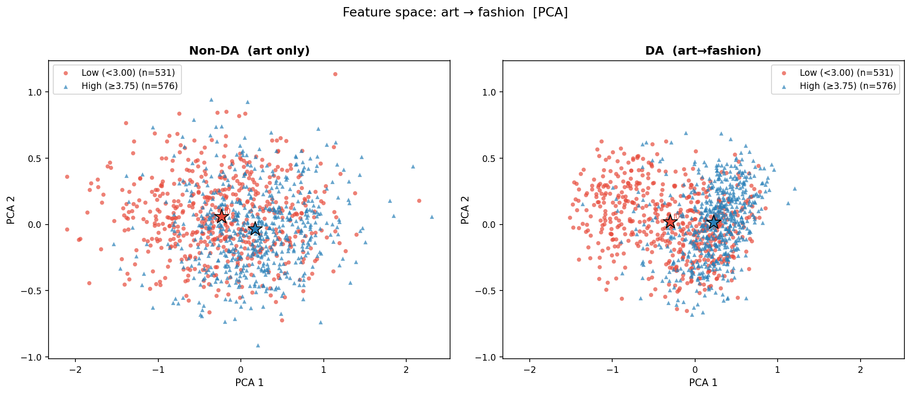

<p align="center">
  
</p>

## 概要

XPASSは、クロスドメイン個人化画像美的評価（PIAA）のための初の大規模データセットです。アート作品、ファッション画像、風景動画の3ドメインから6,528サンプルを収集し、150名のアノテーターによる98,000件以上のユーザー-アイテムインタラクションを含みます。本リポジトリでは、各ドメインにおける一般画像美的評価（GIAA）モデルと個人化美的評価（PIAA）モデルの開発、およびクロスドメインPIAAの新手法を提案しています。
---

## 目次

1. [環境構築](#環境構築)
2. [データ前処理](#データ前処理)
3. [データ分割](#データ分割)
4. [学習（GIAA）](#giaa一般画像美的評価)
5. [ドメイン適応手法](#ドメイン適応手法)
6. [学習（PIAA）](#piaa事前学習--ファインチューニングici--mir)
7. [推論（スタンドアロン）](#推論スタンドアロン)
8. [分析ツール](#分析ツール)
9. [特徴量の次元構成](#特徴量の次元構成)
10. [コミットメッセージ規則](#コミットメッセージ規則)

---

## 環境構築

### 仮想環境の作成と有効化

```bash
# Linux/macOS
python3 -m venv .venv
source .venv/bin/activate
pip install -r requirement.txt
```

```powershell
# Windows (PowerShell)
python -m venv .venv
.\.venv\Scripts\Activate.ps1
pip install -r requirement.txt
```

> **注意:** 以下のコマンドはすべてリポジトリのルートディレクトリ（`src/` を含むフォルダ）から実行してください。別のディレクトリから実行すると `ModuleNotFoundError: No module named 'src'` が発生する場合があります。代替手段として、`PYTHONPATH` をリポジトリルートに設定できます：`export PYTHONPATH=$PWD`

---

## データ前処理

### 必要な生データ

以下のCSVファイルを事前に配置してください：

- `data/raw/user-annotation-data_rows.csv`
- `data/raw/annotation-tasks_rows.csv`
- `data/raw/user-data_rows.csv`
- `data/raw/url_filename_rows.csv`

### users.csv と ratings.csv の作成

ユーザープロファイルテーブル（`users.csv`）とサンプルごとの評価テーブル（`ratings.csv`）を一括で作成します。

- `ratings.user_id` を `users.csv` の `uuid` 経由で整合
- アノテーター品質基準（p_mode・再評価信頼性・反応時間）による自動除外

#### 基本的な使い方

```bash
# デフォルト（引数なし）— すべての除外設定・品質基準にデフォルト値を使用
python src/preprocessing.py make_users_and_ratings

# フォルダや設定を上書きする場合
python src/preprocessing.py make_users_and_ratings \
  --raw-dir data/raw \
  --output-dir data/maked \
  --score-col Aesthetic \
  --min-rs-art-fashion 10 \
  --min-rs-video 30 \
  --fast-user-thresh 0.2 \
  --exclude-videos E5zeYBrVd5o_0034350_0036150.mp4 \
  --exclude-fashion 0940.jpg 1034.jpg \
  --retest-method mae \
  --mad-multiplier 2.5 \
  --outlier-method std
```

`--raw-dir` に指定したフォルダから以下の4つのCSVが自動的に読み込まれます：

- `user-annotation-data_rows.csv`
- `annotation-tasks_rows.csv`
- `user-data_rows.csv`
- `url_filename_rows.csv`

デフォルト設定では、art/fashion で10秒未満、scenery で30秒未満の回答が20%以上のアノテーターが除外されます。

#### アノテーター除外基準

以下の3基準のいずれか1つのドメインでフラグが立った場合に除外されます：

| 基準 | 内容 |
|------|------|
| `p_mode` | モード評価値の割合が集団から外れている（high = bad） |
| `retest` | 同一サンプルの再評価一貫性が低い（MAE: high = bad / ICC・Spearman: low = bad） |
| `rt_prop` | 高速回答（`--min-rs-*` 未満）の割合が `--fast-user-thresh` を超えている |

#### オプション引数一覧

| 引数 | 型 | デフォルト | 説明 |
|------|------|------|------|
| `--raw-dir` | str | `/home/hayashi0884/proj-xpass/data/raw` | 生CSVが格納されたフォルダ |
| `--output-dir` | str | `data/maked` | 出力先フォルダ（`users.csv` と `ratings.csv` を書き出す） |
| `--score-col` | str | `Aesthetic` | p_mode検出・再評価信頼性に使用するスコア列 |
| `--exclude-videos` | list | `E5zeYBrVd5o_0034350_0036150.mp4` | 除外する動画ファイル名のリスト |
| `--exclude-fashion` | list | `0940.jpg 1034.jpg` | 除外するファッション画像ファイル名のリスト |
| `--min-rs-art-fashion` | float | `10` | art/fashionジャンルの最低反応時間（秒） |
| `--min-rs-video` | float | `30` | sceneryジャンルの最低反応時間（秒） |
| `--fast-user-thresh` | float | `0.2` | 最低反応時間を下回る割合の閾値（これ以上なら除外） |
| `--retest-method` | str | `mae` | 再評価信頼性の指標: `spearman` / `icc` / `mae` |
| `--mad-multiplier` | float | `2.5` | 外れ値閾値の乗数 k |
| `--outlier-method` | str | `std` | 外れ値検出手法: `mad`（median ± k×MAD）または `std`（mean ± k×SD） |

#### 出力

- `data/maked/users.csv`
- `data/maked/ratings.csv`

---

## データ分割

### GIAA分割（make_data_split_giaa）

`ratings.csv` を作成した後、GIAA用の train/val/test 画像リストを生成します。`--version` でバージョン管理を行います。

```bash
# 全ジャンル（art, fashion, scenery）の分割を生成
python src/preprocessing.py make_data_split_giaa \
  data/maked/ratings.csv \
  --genre all \
  --version v_giaa \
  --val-frac 0.15 \
  --test-frac 0.15 \
  --out-dir data/split
```

#### オプション引数一覧

| 引数 | 型 | デフォルト | 説明 |
|------|------|------|------|
| `ratings_csv` | str | (必須) | ratings CSVのパス（例: `data/maked/ratings.csv`） |
| `--genre` | str | なし | 分割対象のジャンル（`art` / `fashion` / `scenery` / `all`） |
| `--version` | str | (必須) | 出力ディレクトリ下のバージョン名（例: `v_giaa`） |
| `--val-frac` | float | `0.15` | 検証データの割合（0〜1） |
| `--test-frac` | float | `0.15` | テストデータの割合（0〜1） |
| `--seed` | int | `42` | 乱数シード |
| `--out-dir` | str | `./data/split` | 出力ディレクトリ |

#### 出力（`--genre all --version v_giaa` の場合）

- `data/split/v_giaa/art/{train|val|test}_images_GIAA.txt`
- `data/split/v_giaa/fashion/{train|val|test}_images_GIAA.txt`
- `data/split/v_giaa/scenery/{train|val|test}_images_GIAA.txt`

---

### クロスバリデーション分割（make_data_split_cv）

全ユーザーを均等にn_folds個のグループに分割し、各foldでテストユーザーを交代させるクロスバリデーション用の分割を生成します。各ユーザーは必ずいずれか1つのfoldでテストユーザーになります。

```bash
# 全ジャンル（art, fashion, scenery）の5-fold クロスバリデーション分割を生成（ratings_csv と --genre はデフォルト値）
python src/preprocessing.py make_data_split_cv --version v3

# 引数を明示する場合
python src/preprocessing.py make_data_split_cv \
  data/maked/ratings.csv \
  --genre all \
  --version v3 \
  --n-folds 5 \
  --val-frac-images-giaa 0.1 \
  --val-frac-users-giaa 0.1 \
  --n-train-piaa 100 \
  --n-test-piaa 50 \
  --out-dir data/split
```

#### オプション引数一覧

| 引数 | 型 | デフォルト | 説明 |
|------|------|------|------|
| `ratings_csv` | str | `data/maked/ratings.csv` | ratings CSVのパス |
| `--genre` | str | `all` | 分割対象のジャンル（`art` / `fashion` / `scenery` / `all`） |
| `--version` | str | (必須) | バージョン名のプレフィックス（例: `v3` → `v3_fold1`, `v3_fold2`, ...） |
| `--n-folds` | int | `5` | クロスバリデーションのfold数 |
| `--val-frac-images-giaa` | float | `0.1` | GIAA画像の検証データ割合（0〜1） |
| `--val-frac-users-giaa` | float | `0.1` | GIAAユーザーの検証データ割合（0〜1） |
| `--n-train-piaa` | int | `100` | PIAAのユーザーごとの学習画像数 |
| `--n-test-piaa` | int | `50` | PIAAのユーザーごとのテスト画像数 |
| `--seed` | int | `42` | 乱数シード |
| `--out-dir` | str | `./data/split` | 出力ディレクトリ |

#### 出力（`--genre all --version v3 --n-folds 5` の場合）

各fold（fold1〜fold5）ごとに以下のファイルが生成されます：

**Fold 1の例:**
- `data/split/v3_fold1/art/train_images_GIAA.txt` - GIAA学習用画像リスト
- `data/split/v3_fold1/art/val_images_GIAA.txt` - GIAA検証用画像リスト
- `data/split/v3_fold1/art/train_users_GIAA.txt` - GIAA学習用ユーザーリスト
- `data/split/v3_fold1/art/val_users_GIAA.txt` - GIAA検証用ユーザーリスト
- `data/split/v3_fold1/art/train_users_PIAA.txt` - PIAA学習用（形式: `user_id\tfilename`）
- `data/split/v3_fold1/art/test_users_PIAA.txt` - PIAAテスト用（形式: `user_id\tfilename`）

同様に `fashion` と `scenery` ジャンルについても生成され、これが fold2〜fold5 まで繰り返されます。

> **注意:** GIAAプールとPIAAプールは完全に分離されています。各foldで、PIAAテストユーザー以外のユーザーがGIAAプールに含まれ、そこから画像とユーザーがtrain/valに分割されます。

---

### データセットと分割ファイルの対応表

各データセットがどのtxtファイルに基づいて構築されるかの対応表です。txtファイルはすべて `data/split/{dataset_ver}/{genre}/` に配置されています。

| データセット | txtファイル | 分割単位 | Dataset型 |
|---|---|---|---|
| `train_giaa_dataset` | `train_images_GIAA.txt`（+PIAAユーザー除外） | 画像名 | `Image_GIAA_HistogramDataset` |
| `val_giaa_dataset` | `val_images_GIAA.txt`（+PIAAユーザー除外） | 画像名 | `Image_GIAA_HistogramDataset` |
| `train_piaa_dataset` | `train_PIAA.txt` | user_id × filename | `Image_PIAA_HistogramDataset` |
| `val_piaa_dataset` | `val_PIAA.txt` | user_id × filename | `Image_PIAA_HistogramDataset` |
| `test_piaa_dataset` | `test_PIAA.txt` | user_id × filename | `Image_PIAA_HistogramDataset` |
| `train_giaa_dataset_for_pretrain` | `train_users_GIAA.txt`（fallback: 全データ） | user_id | `Image_PIAA_HistogramDataset` |
| `val_giaa_dataset_for_pretrain` | `val_users_GIAA.txt`（fallback: 全データ） | user_id | `Image_PIAA_HistogramDataset` |

**補足:**
- GIAAデータセットは同一画像の複数評価をヒストグラム（one-hot平均）に集約する。PIAAデータセットは個別の評価をそのまま保持する
- `train/val_giaa_dataset` は `train/val/test_PIAA.txt` に含まれるuser_idを自動的に除外し、PIAAユーザーのリークを防止する
- `train/val_giaa_dataset_for_pretrain` は `train/val_users_GIAA.txt` によるユーザー単位分割を使用する。ファイルが存在しない場合は全データ（ジャンル内の全ratings）がfallbackとして使用される

---

## 学習

### GIAA（一般画像美的評価）

#### オプション引数一覧

| 引数 | 型 | デフォルト | 説明 |
|------|------|------|------|
| `--genre` | str | (必須) | 学習ジャンル（例: `art`, `fashion`, `scenery`） |
| `--dataset_ver` | str | `v1_all` | データ分割バージョン（`data/split/<version>/` を参照） |
| `--backbone` | str | `clip_vit_b16` | バックボーンアーキテクチャ（`resnet50` / `i3d` / `vit_b_16` / `clip_rn50` / `clip_vit_b16`） |
| `--use_video` | flag | `False` | sceneryジャンルで動画データを使用。`--backbone resnet50` と併用時のみ自動的にI3Dバックボーンへ切り替わる。指定しない場合は画像データを使用（バックボーンは `--backbone` の指定に従う） |
| `--root_dir` | str | `/home/hayashi0884/proj-xpass-DA/data` | 画像・動画データのルートディレクトリ |
| `--num_epochs` | int | `200` | 最大エポック数 |
| `--batch_size` | int | `32` | バッチサイズ |
| `--lr` | float | `1e-5` | 学習率 |
| `--lr_decay_factor` | float | `0.5` | ReduceLROnPlateauの減衰率（factor） |
| `--lr_patience` | int | `5` | ReduceLROnPlateauのpatience（改善なしで許容するエポック数） |
| `--max_patience_epochs` | int | `10` | Early stoppingの忍耐エポック数 |
| `--dropout` | float | `0.1` | ドロップアウト率（`fc_aesthetic` の中間層に適用） |
| `--num_workers` | int | `4` | DataLoaderのワーカー数 |
| `--no_log` | flag | `False` | wandbロギングを無効化 |
| `--da_method` | str | `None` | ドメイン適応手法とターゲットドメインを指定。フォーマット: `METHOD-target`（例: `DANN-fashion`, `DJDOT-scenery`）。省略するとドメイン適応なし |
| `--eval_target` | str | `None` | ソースのみ学習中にターゲットジャンルを評価（例: `fashion`）。ドメイン適応なしでターゲットのval EMDを記録する |
| `--dann_epochs` | int | `50` | `[DANN]` λスケジュール: λが〜1.0に達するまでのエポック数。内部で `total_steps = dann_epochs × (data_size / batch_size)` に変換される |
| `--dann_gamma` | float | `10.0` | `[DANN]` λスケジュール: シグモイドの鋭さ（Ganin et al.） |
| `--djdot_alpha` | float | `0.001` | `[DJDOT]` 特徴整合項の重み（L2特徴距離） |
| `--djdot_lambda_t` | float | `0.0001` | `[DJDOT]` ラベル整合項の重み（EMDラベルコスト） |

> **注:** クロスドメイン評価（`--genre` 以外の全ジャンルに対する評価）は常に実行されます。

#### コマンド例

```bash
# art（ドメイン適応なし）
python -m src.train_GIAA --genre art

# art → fashion へのDANN
python -m src.train_GIAA --genre art --da_method DANN-fashion

# art → fashion へのDeepJDOT
python -m src.train_GIAA --genre art --da_method DJDOT-fashion

# fashion
python -m src.train_GIAA --genre fashion

# scenery (画像: CLIP ViT-B/16)
python -m src.train_GIAA --genre scenery

# scenery (動画: I3D)
python -m src.train_GIAA --genre scenery --use_video
```

---

## ドメイン適応手法

GIAA学習（`train_GIAA`）では `--da_method METHOD-target` を指定することでドメイン適応を有効化できます。現在サポートされている手法は以下のとおりです。

| 手法 | `--da_method` 指定例 | 説明 |
|------|---------------------|------|
| **DANN** | `DANN-fashion` | Gradient Reversal Layerによるドメイン識別器の敵対的学習 |
| **DeepJDOT** | `DJDOT-fashion` | 最適輸送（OT）によるジョイント分布整合。特徴距離とEMDラベルコストをコスト行列に使用 |

### DeepJDOT（Deep Joint Distribution Optimal Transport）

$$\min_{\gamma, f, g} \frac{1}{n_s}\sum_i \text{EMD}(y^s_i, f(g(x^s_i))) + \sum_{i,j} \gamma_{ij} \left[ \alpha\|g(x^s_i) - g(x^t_j)\|^2 + \lambda_t \cdot \text{EMD}(y^s_i, f(g(x^t_j))) \right]$$

各バッチで以下の交互最適化を実行します：

1. **γの更新**：コスト行列 $C_{ij} = \alpha\|z^s_i - z^t_j\|^2 + \lambda_t \cdot \text{EMD}(y^s_i, \hat{y}^t_j)$ を構築し、`ot.emd`（network simplex LP）で最適輸送計画γを求める
2. **f, gの更新**：γを固定して合計損失を誤差逆伝播

実装上の詳細：
- OTコスト行列の特徴距離項には `domain_feat`（256次元）を使用
- EMDペア行列は `(n_s, n_t, num_bins)` ブロードキャストで一括計算
- OTソルバーは正確なLP解（network simplex）を使用
- Early stoppingはソースval EMDで判断

#### ペアワイズ適応の例

```bash
# art → fashion
python -m src.train_GIAA --genre art --da_method DJDOT-fashion \
  --dataset_ver v_giaa --djdot_alpha 0.001 --djdot_lambda_t 0.0001

# art → scenery
python -m src.train_GIAA --genre art --da_method DJDOT-scenery \
  --dataset_ver v_giaa

# fashion → scenery
python -m src.train_GIAA --genre fashion --da_method DJDOT-scenery \
  --dataset_ver v_giaa
```

モデルは `models_pth/{dataset_ver}/{source}2{target}/` に保存されます（例: `models_pth/v_giaa/art2fashion/`）。

---

### PIAA事前学習 & ファインチューニング（ICI / MIR）

#### オプション引数一覧

| 引数 | 型 | デフォルト | 説明 |
|------|------|------|------|
| `--genre` | str | (必須) | 学習ジャンル（例: `art`, `fashion`, `scenery`） |
| `--dataset_ver` | str | `v1_all` | データ分割バージョン（`data/split/<version>/` を参照） |
| `--piaa_mode` | str | `PIAA_pretrain` | PIAAモード（`PIAA_pretrain` / `PIAA_finetune`） |
| `--model_type` | str | `ICI` | PIAAモデルアーキテクチャ（`ICI`: インタラクションベース / `MIR`: MLP Interaction Regression） |
| `--backbone` | str | `clip_vit_b16` | バックボーンアーキテクチャ（`resnet50` / `i3d` / `vit_b_16` / `clip_rn50` / `clip_vit_b16`） |
| `--use_video` | flag | `False` | sceneryジャンルで動画データを使用。`--backbone resnet50` と併用時のみ自動的にI3Dバックボーンへ切り替わる。指定しない場合は画像データを使用（バックボーンは `--backbone` の指定に従う） |
| `--root_dir` | str | `/home/hayashi0884/proj-xpass-DA/data` | 画像・動画データのルートディレクトリ |
| `--num_epochs` | int | `200` | 最大エポック数 |
| `--batch_size` | int | `16` | バッチサイズ（pretrain推奨: `128`、finetune推奨: `16`） |
| `--lr` | float | `1e-5` | 学習率 |
| `--lr_decay_factor` | float | `0.5` | ReduceLROnPlateauの減衰率（factor） |
| `--lr_patience` | int | `5` | ReduceLROnPlateauのpatience（改善なしで許容するエポック数） |
| `--max_patience_epochs` | int | `10` | Early stoppingの忍耐エポック数 |
| `--dropout` | float | `0.1` | ドロップアウト率（全MLPの中間層に適用） |
| `--num_workers` | int | `4` | DataLoaderのワーカー数 |
| `--start_fold` | int | `1` | 再開するfold番号（1-indexed）。`--dataset_ver` が `_all` で終わる場合に使用 |
| `--no_log` | flag | `False` | wandbロギングを無効化 |
| `--no_save_model` | flag | `False` | モデルをディスクに保存せず、最良モデルをメモリに保持する |
| `--da_method` | str | `None` | ドメイン適応手法とターゲットドメインを指定。フォーマット: `METHOD-target`（例: `DANN-fashion`, `DJDOT-scenery`）。省略するとドメイン適応なし |
| `--eval_target` | str | `None` | ソースのみ学習中にターゲットジャンルを評価（例: `fashion`）。ドメイン適応なしでターゲットのval EMDを記録する |
| `--dann_epochs` | int | `50` | `[DANN]` λスケジュール: λが〜1.0に達するまでのエポック数。内部で `total_steps = dann_epochs × (data_size / batch_size)` に変換される |
| `--dann_gamma` | float | `10.0` | `[DANN]` λスケジュール: シグモイドの鋭さ（Ganin et al.） |
| `--djdot_alpha` | float | `0.001` | `[DJDOT]` 特徴整合項の重み（L2特徴距離） |
| `--djdot_lambda_t` | float | `0.0001` | `[DJDOT]` ラベル整合項の重み（EMDラベルコスト） |

> **注:** クロスドメイン評価（`--genre` 以外の全ジャンルに対する評価）は常に実行されます。損失関数はMSEで固定です。

#### コマンド例

```bash
# Pretrain
python -m src.train_PIAA --genre art --dataset_ver v2_all \
  --piaa_mode PIAA_pretrain --batch_size 128

# Finetune
python -m src.train_PIAA --genre art --dataset_ver v2_all \
  --piaa_mode PIAA_finetune --batch_size 16

# Finetune: scenery（動画: I3D）
python -m src.train_PIAA --genre scenery --dataset_ver v2_all \
  --use_video --piaa_mode PIAA_finetune --batch_size 16

# MIR: Pretrain
python -m src.train_PIAA --genre art --dataset_ver v2_all \
  --model_type MIR --piaa_mode PIAA_pretrain --batch_size 128

# MIR: Finetune
python -m src.train_PIAA --genre art --dataset_ver v2_all \
  --model_type MIR --piaa_mode PIAA_finetune --batch_size 16
```

---

## 推論（スタンドアロン）

学習済みモデルを使い、`models_pth/` 以下の全foldに対して一括で推論を実行できます。`genre` と `pattern`（`.pth` ファイル名に対するglobパターン）を指定するだけで、対応するfoldを自動検出し、テストセットへの推論と結果JSONの保存を行います。

- ファイル名に `NIMA` を含む → **GIAA** モードで推論
- ファイル名が `_pretrain.pth` で終わる → **PIAA_pretrain** モードで推論
- 結果JSON（`reports/exp/{fold}/{genre}/*.json`）が既に存在する場合はスキップ（`--force` で強制再実行）

```bash
# GIAA (NIMA) モデルの推論（全fold）
python -m src.inference --genre art --pattern "*NIMA*"

# PIAA_pretrain (ICI) モデルの推論（全fold）
python -m src.inference --genre fashion --pattern "*_pretrain*"

# 特定の実験名で絞り込み
python -m src.inference --genre scenery --pattern "*honest-universe*"

# クロスドメイン評価つき（デフォルトで有効）、強制再実行
python -m src.inference --genre art --pattern "*NIMA*" --force
```

#### オプション引数一覧

| 引数 | 型 | デフォルト | 説明 |
|------|------|------|------|
| `--genre` | str | (必須) | 推論対象のジャンル（`art` / `fashion` / `scenery`） |
| `--pattern` | str | (必須) | `.pth` ファイル名に対するglobパターン（例: `"*NIMA*"`, `"*_pretrain*"`） |
| `--root_dir` | str | `/home/hayashi0884/proj-xpass-DA/data` | 画像・動画データのルートディレクトリ |
| `--backbone` | str | `clip_vit_b16` | モデル初期化に使用するバックボーン（学習時と一致させること） |
| `--batch_size` | int | `16` | 推論時のバッチサイズ |
| `--num_workers` | int | `4` | DataLoaderのワーカー数 |
| `--dropout` | float | `0.1` | モデル構造に合わせたドロップアウト率 |
| `--model_type` | str | `None` | pretrainファイルをモデルタイプで絞り込む（`ICI` / `MIR`）。省略時は全マッチファイルを実行 |
| `--force` | flag | `False` | 結果JSONが既に存在しても再実行する |

> **注:** クロスドメイン評価は常に実行されます。`--genre` 以外の全ジャンルのテストセットに対して自動的に評価が行われます。

---

## 分析ツール

### fold結果の集約（aggregate）

クロスバリデーション実験において、各foldのJSONファイルを集約し全ユーザーの平均SROCC/NDCGを出力します。

```bash
# v3の全foldからICI結果を集約
python src/analysis.py aggregate \
  --version v3 \
  --genre art \
  --pattern finetune \
  --method ICI

# 特定のfoldのみ集約
python src/analysis.py aggregate \
  --version v3 \
  --genre art \
  --pattern finetune \
  --folds 0 2 4

# run ID 61以降のファイルのみ集約
python src/analysis.py aggregate \
  --version v3 \
  --genre art \
  --pattern finetune \
  --min-id 61
```

#### オプション引数一覧

| 引数 | 型 | デフォルト | 説明 |
|------|------|------|------|
| `--version` | str | (必須) | データセットバージョン（例: `v3`）— `v3_fold*` ディレクトリを検索 |
| `--genre` | str | (必須) | 分析対象のジャンル（例: `art`, `scenery`） |
| `--pattern` | str | `""` | JSONファイルを絞り込むglobパターン（例: `pretrain`, `finetune`） |
| `--method` | str | なし | JSONファイルをさらに絞り込むメソッド名（例: `ICI`） |
| `--folds` | list | なし | 集約対象のfoldインデックス（例: `--folds 0 2 4`）。省略時は全fold |
| `--min-id` | int | なし | 集約対象のrun IDの下限（例: `61` → `name-61_*.json` 以降のみ対象） |
| `--reports_dir` | str | `reports/exp` | JSONファイルの検索ディレクトリ |

### 特徴量の2D可視化（visualize_features）

DAモデルと非DAモデルの特徴量空間を2次元に投影して比較します。各foldのバリデーション画像に対してNIMAの中間特徴量（`domain_feat`）を抽出し、t-SNE / UMAP / PCA で可視化します。Low / Mid / High の3クラス（`ratings.csv` の全ユーザー平均スコアをパーセンタイルで分類）を色分けしてサブプロットで横並び表示し、クラス分離度を Silhouette Score で定量評価します。

```bash
# art→fashion を t-SNE で可視化（デフォルト設定）
python src/analysis.py visualize_features \
  --source-genre art \
  --target-genre fashion

# t-SNE / UMAP / PCA の3手法すべてを出力
python src/analysis.py visualize_features \
  --source-genre art \
  --target-genre fashion \
  --method all

# スコア（Silhouette Score）のみ計算してプロットはスキップ
python src/analysis.py visualize_features \
  --source-genre art \
  --target-genre fashion \
  --score-only

# fold 1・3 のみ使用し、Mid クラスを非表示にする
python src/analysis.py visualize_features \
  --source-genre art \
  --target-genre fashion \
  --folds 1 3 \
  --hide-mid
```

#### 出力例（art → fashion, PCA）



#### オプション引数一覧

| 引数 | 型 | デフォルト | 説明 |
|------|------|------|------|
| `--source-genre` | str | `art` | ソースドメインのジャンル（モデルの学習元） |
| `--target-genre` | str | `fashion` | ターゲットドメインのジャンル（可視化対象） |
| `--dataset-ver` | str | `v1` | foldディレクトリ探索に使うデータセットバージョン（例: `v1`→`v1_fold*`） |
| `--folds` | list | なし | 使用するfold番号（例: `--folds 1 3`）。省略時は全fold |
| `--backbone` | str | `clip_vit_b16` | バックボーン（保存済みモデルと一致させること）。選択肢: `resnet50`, `vit_b_16`, `clip_rn50`, `clip_vit_b16` |
| `--method` | str | `tsne` | 次元削減手法。選択肢: `tsne`, `umap`, `pca`, `all`（`all` は3手法すべて実行） |
| `--percentile` | float | `25.0` | Low/High クラスの分割パーセンタイル（例: 25 → 下位25%=Low、上位25%=High） |
| `--hide-mid` | flag | False | Mid クラスをプロットから除外して Low/High のみ表示 |
| `--score-only` | flag | False | Silhouette Score のみ計算し、次元削減・プロットをスキップ |
| `--root-dir` | str | `proj-xpass-DA/data` | `maked/` および `split/` を含むデータルートディレクトリ |
| `--models-pth-dir` | str | `proj-xpass-DA/models_pth` | 保存済み `.pth` モデルのルートディレクトリ |
| `-o` / `--output-dir` | str | `reports/feature_viz` | 出力先ディレクトリ。ファイル名は `{source}2{target}_{method}.png` で自動生成 |

---

### ドメインギャップの可視化（visualize_domain_gap）

non-DA モデルと DA モデルそれぞれで、ソース画像とターゲット画像の特徴量を同一空間にプロットし、DA によるドメインギャップ縮小を可視化します。各foldのソース・ターゲット両ドメインの画像を `train_images_GIAA.txt` から収集し、t-SNE / UMAP / PCA で2次元に投影。non-DA（左）では2ドメインが離れて分布し、DA（右）ではそれらが近づく様子を横並びで比較します。ドメイン分離度は Silhouette Score で定量評価し、**値が低いほどドメインギャップが小さい**ことを示します。

```bash
# art→fashion を t-SNE で可視化（デフォルト設定: DANN と Non-DA を比較）
python src/analysis.py visualize_domain_gap \
  --source-genre art \
  --target-genre fashion

# 複数のUDA手法を並べて比較（Non-DA / DANN / DJDOT の3列サブプロット）
python src/analysis.py visualize_domain_gap \
  --source-genre art \
  --target-genre fashion \
  --uda-methods DANN DJDOT

# t-SNE / UMAP / PCA の3手法すべてを出力
python src/analysis.py visualize_domain_gap \
  --source-genre art \
  --target-genre fashion \
  --method all

# スコア（Silhouette Score）のみ計算してプロットはスキップ
python src/analysis.py visualize_domain_gap \
  --source-genre art \
  --target-genre fashion \
  --score-only

# 画像数を絞って高速化・fold 1 のみ使用
python src/analysis.py visualize_domain_gap \
  --source-genre art \
  --target-genre fashion \
  --n-source 100 \
  --n-target 100 \
  --folds 1
```

#### 出力例（art → fashion, PCA）


#### オプション引数一覧

| 引数 | 型 | デフォルト | 説明 |
|------|------|------|------|
| `--source-genre` | str | `art` | ソースドメインのジャンル |
| `--target-genre` | str | `fashion` | ターゲットドメインのジャンル |
| `--dataset-ver` | str | `v1` | foldディレクトリ探索に使うデータセットバージョン（例: `v1`→`v1_fold*`） |
| `--folds` | list | なし | 使用するfold番号（例: `--folds 1 3`）。省略時は全fold |
| `--split-file` | str | `train_images_GIAA.txt` | 各 `fold/<genre>/` 内の画像リストファイル名 |
| `--n-source` | int | なし | fold あたりのソース画像数上限（省略時は全件） |
| `--n-target` | int | なし | fold あたりのターゲット画像数上限（省略時は全件） |
| `--backbone` | str | `clip_vit_b16` | バックボーン（保存済みモデルと一致させること）。選択肢: `resnet50`, `vit_b_16`, `clip_rn50`, `clip_vit_b16` |
| `--uda-methods` | list | `DANN` | Non-DA と比較するUDA手法名（複数指定可）。複数指定するとサブプロットが手法数+1列になる（例: `--uda-methods DANN DJDOT`） |
| `--method` | str | `tsne` | 次元削減手法。選択肢: `tsne`, `umap`, `pca`, `all`（`all` は3手法すべて実行） |
| `--score-only` | flag | False | Silhouette Score のみ計算し、次元削減・プロットをスキップ |
| `--root-dir` | str | `proj-xpass-DA/data` | `maked/` および `split/` を含むデータルートディレクトリ |
| `--models-pth-dir` | str | `proj-xpass-DA/models_pth` | 保存済み `.pth` モデルのルートディレクトリ |
| `-o` / `--output-dir` | str | `reports/feature_viz` | 出力先ディレクトリ。ファイル名は `{source}2{target}_{uda_methods}_domain_gap_{method}.png` で自動生成 |

---

## 特徴量の次元構成

### 個人特性ベクトル（116次元）

`traits` ベクトルはユーザー固有の特性と嗜好を表現し、2つのカテゴリに分かれた116次元で構成されます。

#### 1. スコアベクトル（70次元）

性格および興味に関するアンケート回答。各質問は7段階（0-6）で評価され、ワンホットエンコーディングにより1問あたり7次元となります。

- **Q1-Q10**（70次元）：ビッグファイブ性格モデルに基づく10問の性格特性質問
  - 外向性、協調性、誠実性、神経症的傾向、開放性の次元を含む
  - 各質問がワンホットエンコーディングにより7次元を寄与

> **注:** 興味フィールド（art_interest, fashion_interest, photoVideo_interest）も7次元のワンホットエンコードベクトルであり、スコアベクトルの合計70次元に含まれます。

#### 2. 属性ベクトル（46次元）

人口統計学的属性および背景情報。各属性はカテゴリ数に応じてワンホットエンコーディングされます。

| 属性 | 次元数 | 説明 |
|------|--------|------|
| age_onehot | 5 | 年齢グループ（5区間） |
| gender_onehot | 3 | 性別（3カテゴリ） |
| edu_onehot | 7 | 学歴（7カテゴリ） |
| nationality_onehot | 4 | 国籍（4カテゴリ） |
| art_learn_onehot | 2 | 芸術学習経験（有/無） |
| fashion_learn_onehot | 2 | ファッション学習経験（有/無） |
| photoVideo_learn_onehot | 2 | 写真/映像学習経験（有/無） |

**合計: 70 + 46 = 116次元**

### 画像知覚品質ベクトル - QIP（45次元）

`QIP` ベクトルは各画像/動画から抽出された客観的視覚特徴を含みます。45個の数値特徴が視覚知覚の様々な側面を捉えます。

#### 基本画像特性（6次元）

| # | 特徴量 | 説明 |
|---|--------|------|
| 1 | 画像サイズ | 総画素数 |
| 2 | アスペクト比 | 幅/高さの比率 |
| 3 | RMSコントラスト | 二乗平均平方根コントラスト |
| 4 | 輝度エントロピー | 輝度分布のエントロピー |
| 5 | 複雑さ | 画像全体の複雑さ |
| 6 | エッジ密度 | エッジ画素の密度 |

#### 色特性（20次元）

| # | 特徴量 | 説明 |
|---|--------|------|
| 7 | 色エントロピー | 色分布のエントロピー |
| 8-10 | RGB平均 | R/G/Bチャンネルの平均値 |
| 11-13 | Lab平均 | L/a/bチャンネルの平均値 |
| 14-16 | HSV平均 | H/S/Vチャンネルの平均値 |
| 17-19 | RGB標準偏差 | R/G/Bチャンネルの標準偏差 |
| 20-22 | Lab標準偏差 | L/a/bチャンネルの標準偏差 |
| 23-25 | HSV標準偏差 | H/S/Vチャンネルの標準偏差 |

#### 構図とバランス（6次元）

| # | 特徴量 | 説明 |
|---|--------|------|
| 26 | 鏡像対称性 | 鏡像対称の程度 |
| 27 | DCM距離 | 密度補正モデルにおける距離 |
| 28-29 | DCM位置 | DCMにおけるx/y位置 |
| 30 | バランス | 構図全体のバランス |

#### 対称性特徴（3次元）

| # | 特徴量 | 説明 |
|---|--------|------|
| 31 | CNN対称性（左右） | CNNベースの左右対称性 |
| 32 | CNN対称性（上下） | CNNベースの上下対称性 |
| 33 | CNN対称性（左右＋上下） | 複合CNN対称性 |

#### テクスチャと周波数特性（8次元）

| # | 特徴量 | 説明 |
|---|--------|------|
| 34 | フーリエ勾配 | フーリエスペクトルの勾配 |
| 35 | フーリエシグマ | フーリエ解析のシグマパラメータ |
| 36 | 2Dフラクタル次元 | 2次元フラクタル次元 |
| 37 | 3Dフラクタル次元 | 3次元フラクタル次元 |
| 38 | 自己相似性（PHOG） | PHOGによる自己相似性 |
| 39 | 自己相似性（CNN） | CNNベースの自己相似性 |
| 40 | 異方性 | 方向依存性の指標 |
| 41 | 均質性 | 空間的均一性の指標 |

#### 視覚的複雑さ（3次元）

| # | 特徴量 | 説明 |
|---|--------|------|
| 42 | 1次EOE | 1次エッジ方向エントロピー |
| 43 | 2次EOE | 2次エッジ方向エントロピー |
| 44 | スパース性 | 視覚特徴のスパース性 |
| 45 | 変動性 | 時間的/空間的変動性 |

**合計: 45次元**（img_file列を除く）

これらの特徴量により、ユーザー固有の特性（116次元）と客観的な画像特性（45次元）を組み合わせ、個人化画像美的評価のための包括的な表現を学習できます。

---

## コミットメッセージ規則

本リポジトリでは、コミットメッセージに以下のプレフィックスを使用します。

| プレフィックス | 用途 |
|----------------|------|
| `feat:` | 新機能やモジュールの追加（モデル、関数、CLIなど） |
| `fix:` | バグや不具合の修正 |
| `refactor:` | 内部構造やコードの再構成（動作変更なし） |
| `exp:` | 実験関連ファイルの追加・更新（`experiments/` 以下の変更） |
| `data:` | データファイルの追加・更新（`data/`、`processed/` など） |
| `docs:` | ドキュメントの更新（README、コメント、レポート） |
| `conf:` | 設定ファイルの変更（`configs/`、環境設定） |
| `chore:` | その他の雑務（依存関係の更新、`.gitignore` の修正など） |

#### 例

```text
feat: add ResNet backbone option
fix: correct metric calculation in evaluator
refactor: simplify data loader structure
exp: run baseline with smaller batch size
data: update interim dataset split
docs: update README with setup instructions
conf: adjust base.yaml learning rate
chore: bump dependency versions in pyproject.toml
```
